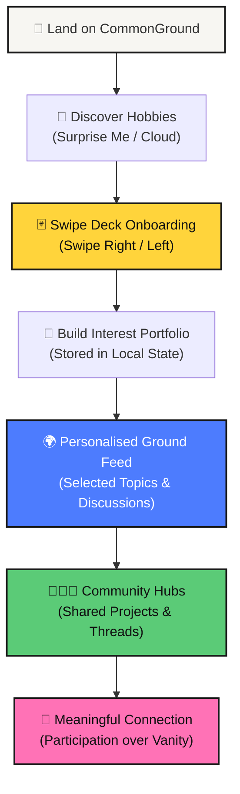
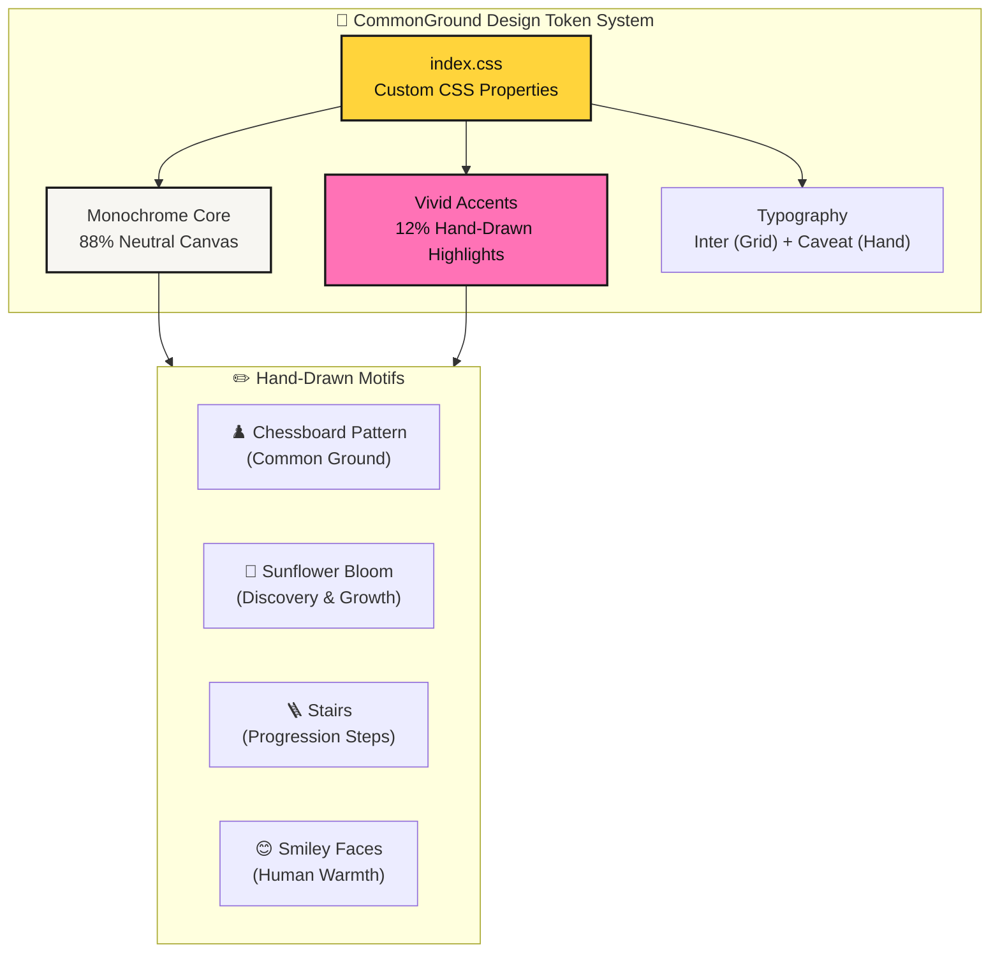
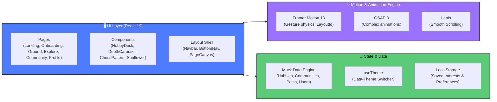
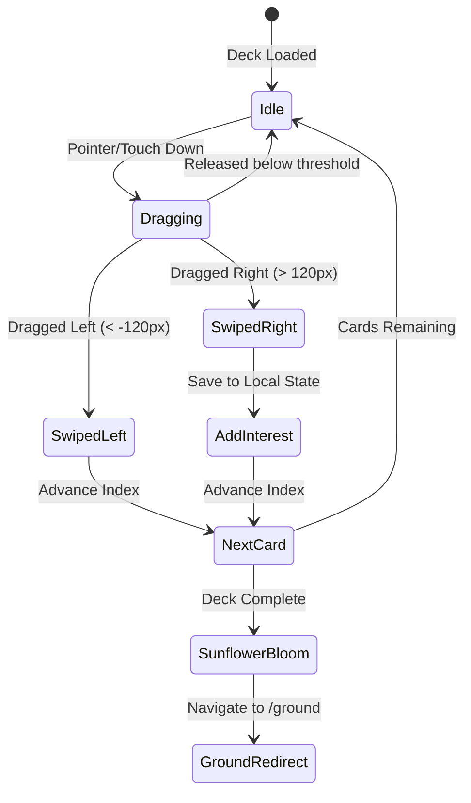
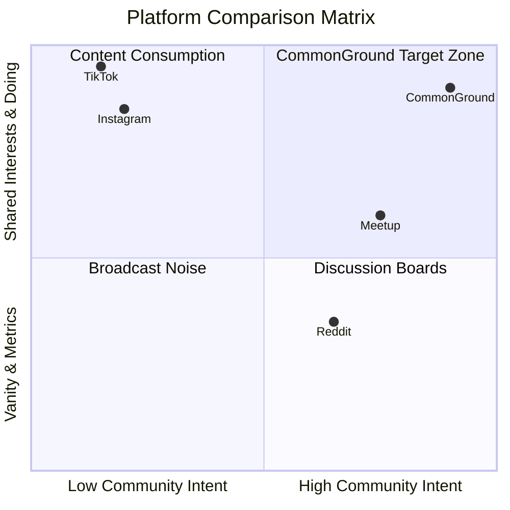

# 🌻 CommonGround

> **Find your people, not just hobbies.**

CommonGround is a hobby discovery and community platform built for college students and young adults. It is not a social network. It's not an infinite content feed. It's the digital room you walk into when you think *"I want to try something new"* — and end up meeting people who share the exact same spark.

---

## 🗺️ Visual User Journey



---

## 📐 Page Wireframes & Layout Mechanics

### 1. Onboarding — Hobby Swipe Deck (`/onboarding`)

```
+-----------------------------------------------------------------------+
|  [🌻 Logo]           [====== Progress: 3/20 ======]         [☀️ Theme] |
+-----------------------------------------------------------------------+
|                                                                       |
|                     ┌───────────────────────────┐                     |
|                     │  📸 Photography     [Creative]│                 |
|                     │ ------------------------- │                     |
|                     │                           │                     |
|                     │   "Capture moments, play  │                     |
|                     │    with light & shadow"   │   <--- (Drag/Swipe) |
|                     │                           │                     |
|                     │   👥 284 Members          │                     |
|                     └───────────────────────────┘                     |
|                        ┌─────────────────────┐                        |
|                        │ Next Card Behind... │                        |
|                        └─────────────────────┘                        |
|                                                                       |
|              [ ❌ PASS (Left) ]      [ 💚 INTERESTED (Right) ]         |
+-----------------------------------------------------------------------+
```

---

### 2. Personalised Ground (`/ground`)

```
+-----------------------------------------------------------------------+
|  [🌻 CommonGround]        Ground   Explore   Profile         [ + Create ]|
+-----------------------------------------------------------------------+
|                                                                       |
|  MY INTERESTS:  [📸 Photography ✖] [🧗 Bouldering ✖] [🎸 Guitar ✖]      |
|                                                                       |
|  +-------------------------------------+  +-------------------------+ |
|  | 📸 Photography Community             |  | 💡 Related Hobbies       | |
|  | "Anyone doing a street shoot this   |  | ----------------------- | |
|  |  weekend in downtown?"              |  | [🎬 Film]               | |
|  |  💬 18 replies  •  2h ago           |  | [✏️ Drawing]            | |
|  +-------------------------------------+  +-------------------------+ |
|  | 🧗 Bouldering Hub                   |  | 📈 Active Communities   | |
|  | "Best indoor shoes for beginners?"   |  | ----------------------- | |
|  |  💬 34 replies  •  5h ago           |  | 🧗 Bouldering (124)     | |
|  +-------------------------------------+  | 📸 Photography (284)    | |
|                                           +-------------------------+ |
+-----------------------------------------------------------------------+
```

---

### 3. Community Hub (`/community/:id`)

```
+-----------------------------------------------------------------------+
|  ← Back to Ground                                                     |
|                                                                       |
|  📸 PHOTOGRAPHY COMMUNITY                           [ + Join Hub ]     |
|  "From street photography to film, capture what others walk past."     |
|  👥 284 Members  •  🏷️ Creative Category                              |
|  -------------------------------------------------------------------- |
|                                                                       |
|  [ Discussions ]    [ Questions ]    [ Projects ]    [ Members ]      |
|                                                                       |
|  +------------------------------------------------------------------+ |
|  | 👤 Alex Chen  •  2 hours ago                      [📸 Photography] |
|  | 💬 "Should I finally switch from phone to a digital camera?"     |
|  | "I've been shooting on mobile for 6 months..."                    |
|  | 💬 14 Comments  •  🤝 8 Interested                             |
|  +------------------------------------------------------------------+ |
+-----------------------------------------------------------------------+
```

---

## 🎨 Design System Architecture



### 📊 Color Balance Visualizer

```
CANVAS NEUTRAL (88%):  [██████████████████████████████████████████] #F7F6F2 / #0D0D0D
ACCENT MARKERS (12%):  [█████] #FFD43B | #4D7CFE | #FF72B6 | #5BCB77 | #FF914D
```

---

## 📊 Category & Hobby Breakdown

```
Creative     [████████████████████] 7 Hobbies  (Photography, Pottery, Film, Drawing, Writing, Fashion, Calligraphy)
Fitness      [█████████] 3 Hobbies             (Running, Bouldering, Cycling)
Lifestyle    [██████] 2 Hobbies                (Cooking, Gardening)
Music        [███] 1 Hobby                     (Guitar)
Tech         [███] 1 Hobby                     (AI & Machine Learning)
Performance  [███] 1 Hobby                     (Dance)
Strategy     [███] 1 Hobby                     (Chess)
Entertainment[███] 1 Hobby                     (Gaming)
Making       [███] 1 Hobby                     (Woodworking)
Science      [███] 1 Hobby                     (Astronomy)
Sports       [███] 1 Hobby                     (Skateboarding)
```

---

## ⚙️ System Architecture



---

## 🔄 Card Swipe State Machine



---

## ⚖️ CommonGround vs Traditional Platforms



---

## 📁 Detailed Codebase Architecture

```
src/
├── animations/
│   └── variants.js          # Centralized spring & fade animation presets
├── components/
│   ├── CardSwap/            # Interactive card swap primitives
│   ├── common/              # System-wide atomic components
│   │   ├── Button            # Primary, Secondary & Ghost buttons
│   │   ├── ChessPattern      # ♟️ Chessboard grid background
│   │   ├── DepthCarousel     # 3D depth carousel
│   │   ├── FlowingMenu       # Dynamic interactive menu
│   │   ├── InteractiveCheckerboard  # Playful hover grid
│   │   ├── InterestTag       # Colored hobby pill tags
│   │   ├── ScrollStack       # Scroll-driven stack effect
│   │   ├── SketchArrow       # SVG hand-drawn arrows
│   │   ├── Smiley            # 😊 Hand-drawn smileys
│   │   ├── Stepper           # Interactive step indicators
│   │   ├── Sunflower         # 🌻 Blooming sunflower illustration
│   │   ├── SunflowerGroup    # Multi-flower illustration scene
│   │   ├── SunflowerMascot   # Interactive sunflower mascot
│   │   └── TextLoop          # Smooth marquee text loops
│   ├── hobby/               # Onboarding deck components
│   │   ├── HobbyCard         # Gesture-enabled card UI
│   │   ├── HobbyDeck         # Stack physics & gesture handler
│   │   └── SwipeControls     # Pass / Interested button row
│   ├── landing/             # Landing page sections
│   │   ├── CommonGroundMerge # Visual merging interest graphic
│   │   ├── CommunityFloat    # Floating community cards showcase
│   │   ├── FinalCTA          # Call-to-action banner
│   │   ├── HobbyCardStack    # Landing card stack preview
│   │   ├── HobbyCloud        # Floating hobby pill cloud
│   │   ├── HobbyPath         # Illustrated journey path
│   │   ├── LandingJourney    # Visual step progression
│   │   ├── RabbitHole        # Deep-dive discovery section
│   │   └── SurpriseMe        # Random hobby generator
│   └── layout/              # App framework
│       ├── BottomNav         # Floating dock for mobile/desktop
│       ├── Footer            # Project footer
│       ├── Navbar            # Top navigation & theme toggle
│       └── PageCanvas        # Responsive canvas wrapper
├── data/                    # Local mock database
│   ├── communities.js       # Community hubs & posts
│   ├── hobbies.js           # 20 curated hobbies across 11 categories
│   ├── posts.js             # Discussion threads & showcases
│   └── users.js             # Mock student profiles
├── hooks/
│   └── useTheme.js          # Persistent dark/light theme switcher
├── pages/                   # Top-level view routes
│   ├── Landing.jsx          # Front door landing page
│   ├── Onboarding.jsx       # Swipe deck hobby selection
│   ├── Ground.jsx           # Personalized feed & interest hub
│   ├── Explore.jsx          # Category directory & discovery
│   ├── Community.jsx        # Dedicated community page
│   ├── CreatePost.jsx       # Thread/post creation tool
│   └── Profile.jsx          # User interest profile
├── App.jsx                  # React Router + AnimatePresence shell
├── index.css                # Global design system & tokens
└── main.jsx                 # Application entry point
```

---

## ⚡ Quick Start

```bash
# 1. Clone repo
git clone https://github.com/your-username/common-ground.git
cd common-ground

# 2. Install dependencies
npm install

# 3. Start local development server
npm run dev

# 4. Lint codebase
npm run lint

# 5. Build for production
npm run build
```

---

<div align="center">

**CommonGround** — *Find your people, not just hobbies.*

🌻 ♟️ 😊

</div>
